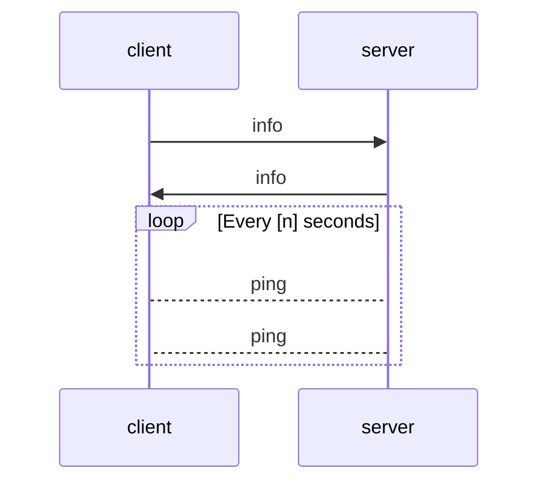

# Doghole

NAT traverse system

## protocol

```mermaid
sequenceDiagram
    client->>server: info
    server->>client: info
    loop Every [n] seconds
        client-->server: ping
        server-->client: ping
    end
```